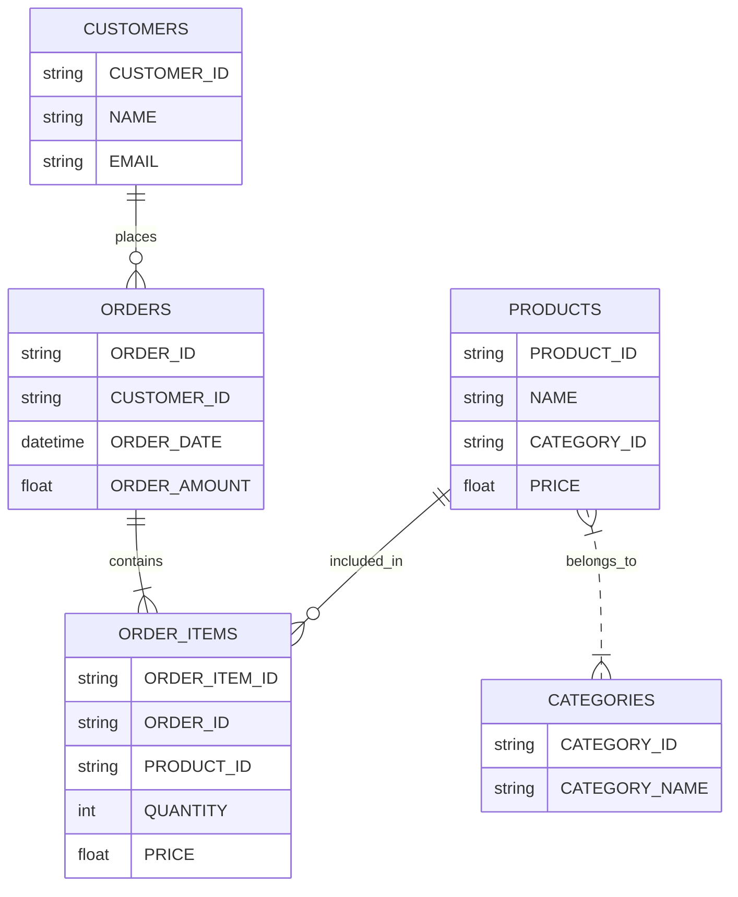
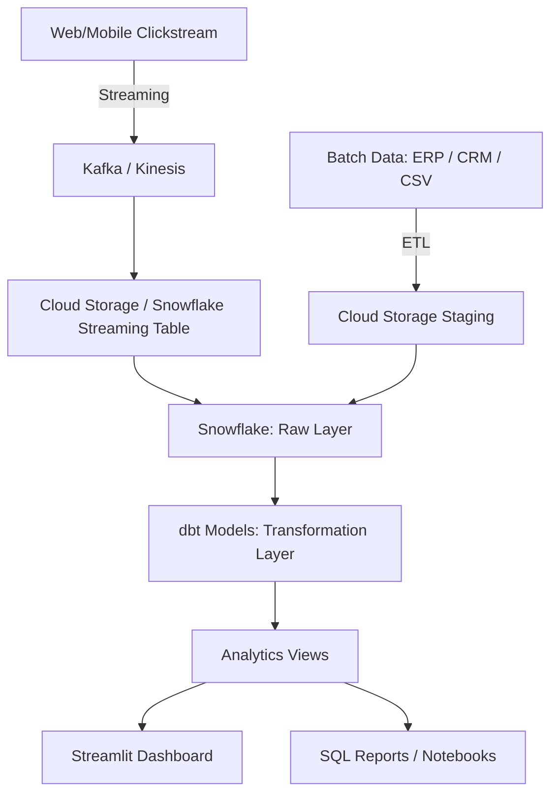

# Customer Analytics Data Pipeline

This project demonstrates a complete end-to-end customer analytics data pipeline for an e-commerce platform, integrating batch and real-time data ingestion, transformation with dbt, orchestration with Airflow, and analytics-ready outputs. The goal is to provide actionable insights on customer behavior, sales trends, and anomalies while maintaining scalability, cost-efficiency, and data freshness.

---

## 1️⃣ GitHub Project Structure

```
Pipeline/
│
├── airflow/
│   ├── dags/                     # Airflow DAGs
│   │   └── customer_pipeline.py
│   ├── data/
│   ├── log/
│   └── airflow.cfg
│
├── my_project/                   # DBT models
│   ├── models/
│   │   ├── my_first_dbt_model.sql
│   │   ├── anomalies.sql
│   │   ├── top_customers.sql
│   │   └── product_category_sales.sql
│   └── dbt_project.yml
│
├── analytics/                    # SQL reports & notebooks
│   └── sample_reports.sql
│
├── Dashboards                    # Streamlit dashboard + screenshots
│   └── app.py
│
├── README.md                     # Project story, architecture diagrams
└── docs/                         # ERD & pipeline diagrams (png/drawio)
```

---

## 2️⃣ Markdown Documentation (README.md)

### **Business Problem**

We aim to track customer behavior and sales across channels to improve revenue, retention, and operational decision-making.

---

### **Pipeline Architecture**

The pipeline is designed with a **conceptual star schema** to model customer, product, and order data. It integrates both **batch ingestion** from legacy systems and **real-time ingestion** from clickstream sources into Snowflake, with transformation logic handled by dbt, orchestration via Airflow, and reporting via dashboards.

---

#### **Entity-Relationship Diagram (ERD)**



---

#### **Data Pipeline Flow (Hybrid Ingestion + Transformation + Dashboard)**



---

### **DBT Models**

* Models implement business logic such as **top customers**, **sales by category**, and **anomaly detection**.
* Incremental and view-based models allow efficient transformations while keeping raw data intact.

---

### **Airflow DAG**

* Orchestrates ingestion, transformation, and data quality checks.
* Includes scheduled **batch ETL** and **streaming pipeline triggers**.

---

### **Advanced Data Quality Check & Imputation**

* Includes **null checks**, **default value imputation**, and **anomaly detection**.
* DBT tests and SQL scripts ensure data integrity before analytics.

---

### **Hybrid Data Ingestion Strategy**

* **Batch Data**: ERP, CRM, CSV exports via S3, ADLS, or OCI staging, loaded using AWS Glue, Azure Data Factory, or OCI Data Integration.
* **Real-Time Data**: Web/app clickstream via Kafka, Kinesis, or Event Hubs into Snowflake streaming tables, optionally transformed with Snowpipe + dbt.
* Ensures **data freshness, scalability, and cost-effectiveness**.

---

### **10% Innovation (Crucial Step)**

* Optional **AI-driven anomaly detection** or **predictive sales forecasting**.
* Could include **automated alerts** for data quality issues or **real-time sales insights**.

---

### **AI / Non-AI Tools Used**

* **dbt, Snowflake, Airflow, Streamlit, Python, SQL, Draw\.io**
* **ChatGPT prompts** for generating code snippets and pipeline logic

---

## 3️⃣ Deliverables Pushed to GitHub

1. DBT models & `dbt_project.yml`
2. Airflow DAG Python file (`airflow/dags/customer_pipeline.py`)
3. SQL scripts & analytics reports (`analytics/`)
4. Markdown documentation (`README.md`)
5. ERD & pipeline diagrams (`docs/`)
6. Screenshots: Airflow run logs, sample dashboard outputs

---

## 4️⃣ Next Actions for You

The next steps in my project focus on implementing a **hybrid data ingestion strategy** that efficiently integrates both batch transactional data and real-time clickstream data into Snowflake.

* **Batch Data** (SQL Server, Oracle, CSV/Excel exports): staged in cloud object storage (S3, ADLS, OCI) and loaded via ETL tools (Glue, Data Factory, OCI DI) on nightly/hourly schedules.
* **Real-Time Data** (web/mobile apps): ingested using Kafka, Kinesis, or Event Hubs into Snowflake streaming tables, optionally transformed with dbt + Snowpipe.

This hybrid flow ensures:

* **Real-time freshness** via Snowpipe for streaming.
* **Scalability** through cloud-managed storage + ETL.
* **Cost optimization** by keeping raw data in object storage and computing only during transformations.

All data is then modeled with dbt into **analytics views and dashboards** for actionable insights.

---

